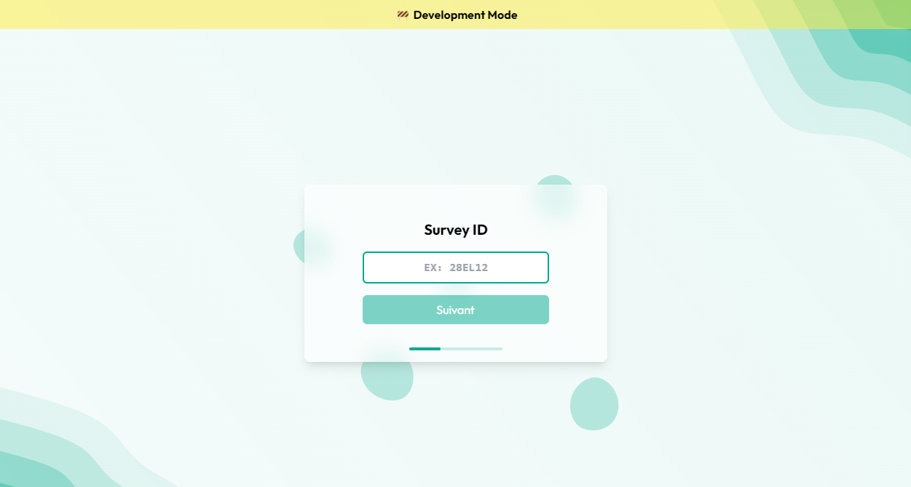

# ⚙️ DevBanner

**A simple React component to display a development mode banner.**

It uses the `process.env.NODE_ENV` variable to determine whether the application is running in a production environment. If not, it displays a banner at the top of the page to indicate that the application is in development mode.

## ✨ Features

-   🚀 Automatically prefixes the page title with a development mode indicator.
-   🎨 Customizable banner message and styles.
-   🌐 Only displays in non-production environments.

## 📦 Installation

Install the package using npm:

```bash
npm install dev-banner
```

## 🔧 Usage

Import and use the `DevBanner` component in your React application:

> Check if we are in development mode by using `vite` env :

```typescript
import React from "react";
import { DevBanner } from "dev-banner";

const IS_DEV = import.meta.env.MODE === "development";
function App() {
    return (
        <div>
            <DevBanner isDev={IS_DEV} />
            <h1>My Application</h1>
        </div>
    );
}
```

> Check if we are in development mode by using the `hostname` :

```typescript
import React from "react";
import { DevBanner } from "dev-banner";

const IS_DEV = window.location.hostname !== "example.com";

function App() {
    return (
        <div>
            <DevBanner isDev={IS_DEV} />
            <h1>My Application</h1>
        </div>
    );
}

export default App;
```

## ⚙️ Props

| Prop                    | Type    | Default Value  | Required | Description                                     |
| ----------------------- | ------- | -------------- | -------- | ----------------------------------------------- |
| `isDev`                 | boolean | false          | ✅       | Whether the application is in development mode. |
| `title`                 | string  | ⚠️ DEV MODE ⚠️ |          | Custom title for the banner.                    |
| `pagePrefix`            | string  | (DEV)          |          | Prefix for the page title.                      |
| `displayPagePrefix`     | boolean | true           |          | Whether to display the page prefix.             |
| `consoleMessage`        | string  | ⚠️ DEV MODE ⚠️ |          | Custom message to log in the console.           |
| `displayConsoleMessage` | boolean | true           |          | Whether to log the console message.             |
| `className`             | string  | -              |          | Additional CSS classes for the banner.          |
| `style`                 | object  | -              |          | Custom styles for the banner.                   |

## 🌟 Example



> Code

```typescript
import { DevBanner } from "dev-banner";
const IS_DEV = import.meta.env.MODE === "development";

const rootElement = document.getElementById("root")!;
if (!rootElement.innerHTML) {
    const root = ReactDOM.createRoot(rootElement);
    root.render(
        <StrictMode>
            <DevBanner isDev={IS_DEV} title="🚧 Development Mode" />
            <RouterProvider router={router} />
        </StrictMode>
    );
}
```
